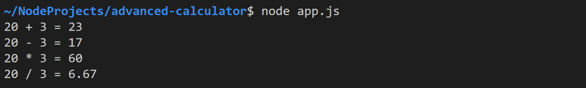
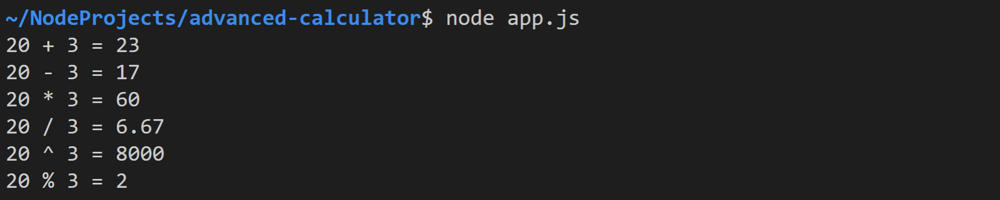

# Advanced Calculator

Erstellen Sie die Datei `app.ts`. Fügen Sie darin den gesamten Code von *Simple Calculator* mithilfe von *Copy & Paste* ein.

## Task 1: Function Expressions

Deklarieren Sie alle vorhandenen Funktionen mithilfe von Funktionsausdrücken. Die Funktion `printCalculation` sollte beispielsweise folgendermaßen aussehen:

``` typescript
let printCalculation = function (operator: string, calc: (a: number, b: number) => number) {
    console.log("20 " + operator + " 3 = " + calc(20, 3));
}
```

Führen Sie nach der Anpassung aller Funktionen, die `app.js` aus. Die Konsolenausgabe sollte sich im Vergleich zu *Simple Calculator* nicht verändert haben.



## Task 2: Anonymous Functions

Als Nächstes soll 20³ (in TypeScript `20 ** 3`) ausgegeben werden. Verwenden Sie für die Berechnung des Ergebnisses eine anonyme Funktion. Diese wird, im Gegensatz zu den bisherigen Funktionen, keiner Variable zugewiesen (und ist daher auch nur einmalig verwendbar).

``` javascript
printCalculation("^", function (a, b) {
    return a ** b;
});
```

Rufen Sie `printCalculation` ein weiteres Mal mit einer anonymen Funktion auf, um auch `20 % 3` darzustellen . Zur Erinnerung: `%` ermittelt den Divisionsrest (in diesem Fall also `2`). 

Die Konsolenausgabe sollte somit folgendermaßen aussehen:


